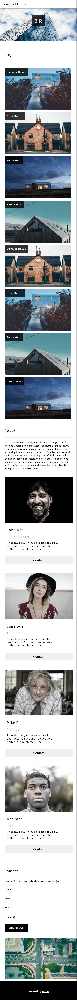
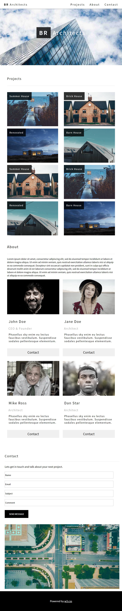
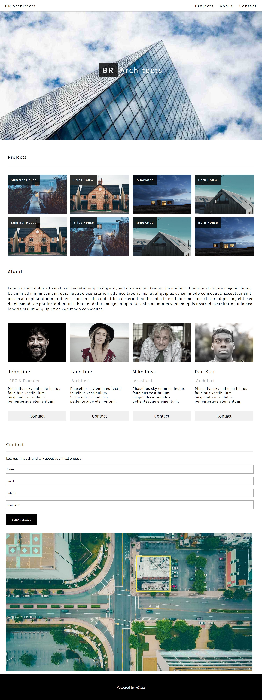

# 김다보미 클론코딩(2) 과제
> 22-10-27

## GlobalStyles.js / MediaQuery.js / Meta.js / index.js 생략
## App.js
```javascript
import React,{memo} from 'react';
import {Routes,Route} from 'react-router-dom';
import Navbar from './common/Navbar';
import Footer from './common/Footer';
import Main from './pages/Main';
import Project from './pages/Main/Project';
import About from './pages/Main/About';
import Contact from './pages/Main/Contact';

const App = memo(() => {
  return (
    <div>
      <Navbar />
      <Routes>
        <Route path='/' exact={true} element={<Main />} />
        <Route path='/project' element={<Project />} />
        <Route path='/about' element={<About />} />
        <Route path='/contact' element={<Contact />} />
      </Routes>
      <Footer />
    </div>
  );
});

export default App;
```

## Navbar.js
```javascript
import React,{memo} from 'react';
import styled from 'styled-components';
import {NavLink} from 'react-router-dom';
import mq from '../MediaQuery';


const NavbarContainer = styled.nav`
    width: 100%;
    position: fixed;
    padding: 0 10px 10px;
    box-sizing: border-box;
    z-index: 9999;
    background-color: #fff;
    box-shadow: 0.5px 0.5px 5px gray;
    font-size: 17px;
    top: 0;

    div {
        margin-top: 10px;
        width: 100%;
        
        .left {
            float: left;
            letter-spacing: 0.2em;
            padding: 5px 15px;

            box-sizing: border-box;   
            text-decoration: none;
            color: black;
            &:hover {
                background-color: #ccc;
            }
            span {
                font-weight: bold;
            }
        }
        .link {
            a {
                float: right;
                padding: 5px 15px;
                box-sizing: border-box;
                color: black;
                text-decoration: none;
                letter-spacing: 0.2em;
            }
            ${mq.maxWidth('sm')`
                display: none;
            `}
        }
    }
`;
const Navbar = memo(() => {
  return (
    <NavbarContainer>
        <div>
            <NavLink to="/" className="left"><span>BR</span> Architects</NavLink>
            <div className='link'>
                <NavLink to="/contact">Contact</NavLink>
                <NavLink to="/about">About</NavLink>
                <NavLink to="/project">Projects</NavLink>
            </div>
        </div>
    </NavbarContainer>
  );
});

export default Navbar;
```

## Main/index.js
```javascript
import React from 'react';
import styled from 'styled-components';
import Project from './Project';
import About from './About';
import Contact from './Contact';
import architect from '../../assets/img/architect.jpg';
import mq from '../../MediaQuery';


const MainContainer = styled.section`
  figure{
    display: flex;
    position: relative;
    width: 100%;
    margin: 0;
    img {
      width: 100%;
    }
    figcaption {
    position: absolute;
    left: 50%;
    top: 50%;
    transform: translate(-50%,-50%);
    font-size: 34px;
    letter-spacing: 0.15em;
    color: white;

      span:first-child {
        font-weight: bolder;
        background-color: black;
        padding: 10px 17px;
        filter: opacity(0.8);
      }
      span:last-child {
        ${mq.maxWidth('sm')`
          display: none;
        `}
      }
    }
  }
`;


const Main = () => {
  return (
    <MainContainer>
        <figure>
          
          <figcaption><span>BR</span><span> Architects</span></figcaption>
        </figure>
        <Project />
        <About />
        <Contact />
    </MainContainer>
  )
}

export default Main;
```

## Project.js
```javascript
import React,{memo} from 'react';
import styled from 'styled-components';
import img01 from '../../assets/img/house5.jpg';
import img02 from '../../assets/img/house2.jpg';
import img03 from '../../assets/img/house3.jpg';
import img04 from '../../assets/img/house4.jpg';
import img05 from '../../assets/img/house2.jpg';
import img06 from '../../assets/img/house5.jpg';
import img07 from '../../assets/img/house4.jpg';
import img08 from '../../assets/img/house3.jpg';
import mq from '../../MediaQuery';

const ProjectContainer = styled.div`
  margin: auto;
  width: 94%;
  
  h3 {
    margin-top: 70px;
    letter-spacing: 0.1em;
    font-size: 20px;
    margin-bottom: 30px;
    font-weight: normal;
    ${mq.maxWidth('lg')`
      margin-left: 3%;
    `}
    ${mq.maxWidth('sm')`
      margin-left: 3%;
    `}
  }
  hr {
    width: 94%;
    border: 0.1px solid #eee;
  }
  
  .content {
    margin-top: 40px;
    width: 100%;
    figure {
      position: relative;
      display: flex;
      float: left;
      margin-right: 1.5%;
      margin-bottom: 1.5%;
      width: 23.85%;
      height: 10%;
      ${mq.maxWidth('lg')`
        float: left;
        width: 44.5%;
        margin: 0;
        margin-right: 15px;
        margin-bottom: 15px;
        margin-left: 3%;
      `}
      ${mq.maxWidth('sm')`
        margin: 0;
        width: 92%;
        margin-left: 3%;
        margin-bottom: 15px;
      `};
      
     
      img {
        width: 100%;
        height: 10%;
        ${mq.maxWidth('lg')`
          width: 100%;
          height: 10%;
        `}
        ${mq.maxWidth('sm')`
          width: 100%;
          height: 270px;
        `}
        
      }
      &:nth-child(4),&:nth-child(8) {
        margin-right: 0;
      }
      .content figure:nth-child(2),.content figure:nth-child(4),.content figure:nth-child(6),.content figure:nth-child(8) {
        ${mq.maxWidth('lg')`
          margin-right: 0;
        `}
      }
      
      figcaption {
        position: absolute;
        left: 0%;
        top: 0%;
        transform: translate(0,0);
        color: white;
        background-color: rgba(0,0,0,.8);
        font-size: 14px;
        padding: 15px;
      }
    }
  }
`;

const imgList = [
  {img: img01, title: 'Summer House'},
  {img: img02, title: 'Brick House'},
  {img: img03, title: 'Renovated'},
  {img: img04, title: 'Barn House'},
  {img: img05, title: 'Summer House'},
  {img: img06, title: 'Brick House'},
  {img: img07, title: 'Renovated'},
  {img: img08, title: 'Barn House'}
];

const Project = memo(() => {
  return (
    <ProjectContainer>
      <div>
        <h3>Projects</h3>
        <hr />
        <div className="content">
          {imgList.map((v,i) => {
            return (
              <figure key={i}>
                  
                  <figcaption>{v.title}</figcaption>
              </figure>
            )
          })}
        </div>
      </div>
    </ProjectContainer>
  );
});

export default Project;
```

## About.js
```javascript
import React from 'react';
import styled from 'styled-components';
import team01 from '../../assets/img/team2.jpg';
import team02 from '../../assets/img/team1.jpg';
import team03 from '../../assets/img/team3.jpg';
import team04 from '../../assets/img/team4.jpg';
import mq from '../../MediaQuery';

const AboutContainer = styled.div`
  margin: auto;
  clear: both;
  width: 94%;
  h3 {
    margin-top: 70px;
    letter-spacing: 0.1em;
    padding-top: 40px; 
    font-size: 22px; 
    margin-bottom: 30px;
    font-weight: normal;
    ${mq.maxWidth('lg')`
      margin-left: 3%;
    `}
    ${mq.maxWidth('sm')`
      margin-left: 3%;
    `}
  }
  hr {
    width: 94%;
    border: 0.1px solid #eee;
  }
  p {
    width: 94%;
    margin-top: 20px; 
    font-size: 17px; 
    line-height: 1.5em;
    letter-spacing: 0.1em;
    ${mq.maxWidth('lg')`
      font-size: 14px;
      letter-spacing: 0;
      margin-left: 3%;
    `}
  }
  .members {
    float: left;
    width: 23.8%; 
    margin-top: 40px; 
    margin-right: 1.5%;
    ${mq.maxWidth('lg')`
      width: 45.5%;
      margin: 0;
      margin-right: %;
      margin-left: 3%;
    `}
    ${mq.maxWidth('sm')`
      width: 94%;
      margin: 0;
      margin-top: 30px;
      margin-left: 3.5%;
    `}
    &:last-child {
      margin-right: 0;
      ${mq.maxWidth('lg')`
        margin-bottom: 70px;
      `}
    }
    &:nth-child(2),&:nth-child(4) {
      ${mq.maxWidth('lg')`
        margin-right: 0;
      `}
    }
    img {
      filter: grayscale(70%);
      width: 100%;
      ${mq.maxWidth('lg')`
        width: 100%;
      `}
    }
    h3 {
      margin-top: 0; 
      font-size: 21px; 
      line-height: 0.1em;
    }
    span {
      margin-top: 0; 
      font-size: 18px; 
      color: #aaa;
      letter-spacing: 0.1em;
      margin-left: 2.5%;
    }
    p {
      margin-top: 15px; 
      letter-spacing: 0.1em;
      line-height: 1.3em;
      font-size: 16px;
    }
    button {
      border: 0; 
      width: 100%; 
      height: 50px; 
      font-size: 20px;
      margin-top: 20px; 
      margin-bottom: 100px;
      &:hover {
        background-color: rgba(0,0,0,.3);
      }
      ${mq.maxWidth('lg')`
        margin: 0;
        width: 100%;
        margin-top: 20px;
        margin-bottom: 30px;      
      `}
    }
  }
`;

const teamList = [
  {img: team01, name: 'John Doe', job: 'CEO & Founder'},
  {img: team02, name: 'Jane Doe', job: 'Architect'},
  {img: team03, name: 'Mike Ross', job: 'Architect'},
  {img: team04, name: 'Dan Star', job: 'Architect'}
];

const About = () => {
  return (
    <AboutContainer>
      <div>
        <h3>About</h3>
        <hr/>
        <p className='default'>Lorem ipsum dolor sit amet, consectetur adipiscing elit, sed do eiusmod tempor incididunt ut labore et dolore magna aliqua. Ut enim ad minim veniam, quis nostrud exercitation ullamco laboris nisi ut aliquip ex ea commodo consequat. Excepteur sint occaecat cupidatat non proident, sunt in culpa qui officia deserunt mollit anim id est laborum consectetur adipiscing elit, sed do eiusmod tempor incididunt ut labore et dolore magna aliqua. Ut enim ad minim veniam, quis nostrud exercitation ullamco laboris nisi ut aliquip ex ea commodo consequat.</p> 
        <div className='team'>
          {teamList.map((v,i) => {
            return (
              <div className='members' key={i}>
                
                <h3>{v.name}</h3>
                <span>{v.job}</span>
                <p>Phasellus sky enim eu lectus faucibus vestibulum. Suspendisse sodales pellentesque elementum.</p>
                <button>Contact</button>
              </div>
            )
          })}
        </div>
      </div>
    </AboutContainer>
  );
};

export default About;
```

## Contact.js
```javascript
import React,{memo} from 'react';
import Map from '../../assets/img/map.jpg';
import styled from 'styled-components';


const ContactContainer = styled.div`
  width: 94%;
  margin: 0 30px;
  img {
    margin-top: 30px;
    width: 100%;
  }
  h3 {
    font-size: 20px;
    letter-spacing: 0.1em;
    margin-bottom: 20px;
    font-weight: normal;
  }
  p {
    margin: 20px 0;
  }
  hr {
    width: 100%;
    border: 0.1px solid #eee;
  }
  input {
    height: 40px;
    margin-bottom: 15px;
    border-radius: 0;
    border: 0.2px solid #aaa;
    width: 94%;
  }
  button {
    border: 0;
    background-color: black;
    width: 150px;
    height: 50px;
    font-size: 13px;
    margin: 10px 0;
    color: white;
    &:hover {
      background-color: #aaa;
      color: black;
    }
  }
`;
const Contact = memo(() => {
  return (
    <ContactContainer>
      <div className="contact">
        <h3>Contact</h3>
        <hr />
        <p>Lets get in touch and talk about your next project.</p>
        <form className='info'>
            <input type="text" className="name" defaultValue="Name" required />
            <input type="email" className="email" defaultValue="Email" required />
            <input type="text" className="subject" defaultValue="Subject" required />
            <input type="text" className="comment" defaultValue="Comment" required />
            <button className="submit" type="submit">SEND MESSAGE</button>
        </form>
        
      </div>
    </ContactContainer>
  );
});

export default Contact;
```

## Footer.js
```javascript
import React from 'react';
import styled from 'styled-components';

const FooterContainer = styled.footer`
  background-color: black;
  padding: 35px 0;
  box-sizing: border-box;
  margin-top: 10px;
  p {
    color: white;
    font-size: 16px;
    text-align: center;
    a {
      color: white;
    }
  }  
`;

const Footer = () => {
  return (
    <FooterContainer>
        <p>
            Powered by <a href="#">w3.css</a>
        </p>
    </FooterContainer>
  );
};

export default Footer;
```

## 실행화면


